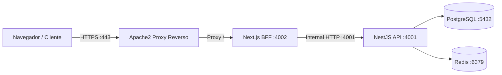

# Hardening e Segurança do Proxy Reverso Apache2 (Apache Security)

> **Classificação**: Documento de Infraestrutura e Operação
> **Controlador Institucional**: Universidade Estadual de Campinas — UNICAMP (CNPJ: 46.068.425/0001-33)
> **Arquivo de Configuração**: `infrastructure/proxy/arqueia.cp2b.unicamp.br.apache.conf`

---

## 1. Topologia de Proxy Reverso e Roteamento Confiável

O servidor web Apache2 atua como ponto único de terminação TLS e fronteira de rede pública na VM Debian institucional:
- **Portas Externas**: 80 (Redirecionamento 301 para HTTPS) e 443 (HTTPS/TLS obrigatório na fronteira pública com certificado Let's Encrypt / institucional).
- **Cadeia de Roteamento de Aplicação**:
  1. **Cliente Público (Navegador)** $\rightarrow$ Conecta via HTTPS no Apache (`:443`).
  2. **Apache (`:443`)** $\rightarrow$ Normaliza o IP do cliente via `mod_remoteip` e faz proxy de **todas as rotas públicas** (`/` e `/api/*`) para o **Next.js BFF (`127.0.0.1:4002`)**.
  3. **Next.js BFF (`:4002`)** $\rightarrow$ Serve as páginas React, gerencia o cookie `HttpOnly` de sessão (`arqueia_session`), valida a origem (`hasTrustedOrigin`), anexa o token Bearer e faz chamadas internas autorizadas para a **API NestJS (`127.0.0.1:4001`)** via loopback.
  4. **API NestJS (`:4001`)** $\rightarrow$ Executa os casos de uso de negócio, valida permissões no servidor (`PermissionEvaluator`), acessa PostgreSQL (`:5432`) e Redis (`:6379`).



> **Invariante de Roteamento**: O Apache **NÃO** faz proxy direto de `/api/` para o NestJS. Todo o tráfego de interface passa pelo Next.js BFF para garantir a correta gestão de cookies HttpOnly e origin checks.

---

## 2. Cabeçalhos de Segurança Obrigatórios (Security Headers)

A configuração do VirtualHost HTTPS (`:443`) injeta cabeçalhos de segurança em todas as respostas:

```apache
# HSTS (HTTP Strict Transport Security) - 1 ano com subdomínios
Header always set Strict-Transport-Security "max-age=31536000; includeSubDomains"

# Prevenção de MIME-sniffing
Header always set X-Content-Type-Options "nosniff"

# Prevenção de Clickjacking
Header always set X-Frame-Options "SAMEORIGIN"

# Política de Referenciador
Header always set Referrer-Policy "strict-origin-when-cross-origin"

# Ocultação da versão do servidor
ServerTokens Prod
ServerSignature Off
```

---

## 3. Configurações de TLS e Criptografia em Trânsito

- Certificados gerenciados e renovados automaticamente via **Certbot** (`certbot renew`) ou emitidos pela autoridade certificadora institucional da UNICAMP.
- Protocolos suportados: **TLSv1.2** e **TLSv1.3** (desativação explícita de SSLv3, TLSv1.0 e TLSv1.1 obsoletos).
- Conjunto de cifras moderno configurado conforme as recomendações de segurança da UNICAMP e Mozilla Intermediate/Modern.

---

## 4. Normalização de Headers de Proxy e Prevenção de IP Spoofing

1. **Módulo `mod_remoteip` e Neutralização de Headers Arbitrários**:
   ```apache
   RemoteIPHeader X-Forwarded-For
   RemoteIPInternalProxy 127.0.0.1
   ProxyPreserveHost On
   ```
2. **Cadeia de Confiança de IP**:
   - O Apache inspeciona a conexão TCP direta e adiciona o IP de origem ao cabeçalho `X-Forwarded-For`.
   - Headers arbitrários de `X-Forwarded-For` enviados diretamente por atacantes na Internet são substituídos ou normalizados pelo Apache.
   - O Next.js BFF repassa esse cabeçalho confiável para a API NestJS, onde o `AuthRateLimitGuard` extrai o IP real do cliente para aplicação das regras de proteção de força bruta.
