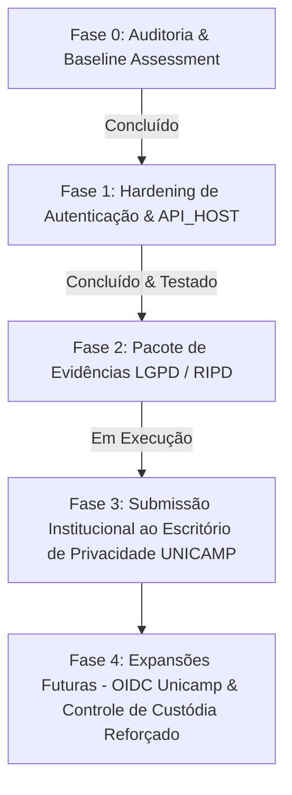

# Roteiro de Implementação de Segurança e Privacidade (Implementation Roadmap)

> **Classificação**: Documento Técnico de Engenharia
> **Controlador Institucional**: Universidade Estadual de Campinas — UNICAMP (CNPJ: 46.068.425/0001-33)
> **Conclusão Técnica**: `TECHNICALLY PREPARED FOR INSTITUTIONAL LGPD/RIPD REVIEW`

---

## 1. Status das Fases de Implementação

---

## 2. Detalhamento das Fases

### Fase 0: Descoberta e Linha de Base (Concluída)
- Mapeamento exaustivo da arquitetura SOLID, migrações e entidades do banco.
- Identificação de zero public signup, hashing Argon2id e trilha de auditoria imutável.
- Classificação dos gaps técnicos.

### Fase 1: Hardening de Autenticação e Segurança de Rede (Concluída)
- **`API_HOST` Parametrizado**: Suporte a bind `127.0.0.1` nativo em produção e `0.0.0.0` em Docker de desenvolvimento, com validação Zod no schema de ambiente.
- **Auditoria de Falhas de Login**: Emissão do evento imutável `identity.login.failed` para credenciais inválidas, contas bloqueadas e usuários inexistentes (anônimo, sem vazamento de existência ou de senhas submetidas).
- **Gestão Atômica de Lockout**: Ativação das colunas `failed_attempts` e `locked_until` com incremento atômico em banco de dados e reset em logins bem-sucedidos.
- **Rate Limiting em Camada de Aplicação**: Criação do `AuthRateLimiterService` e `AuthRateLimitGuard` aplicados aos endpoints de login, troca de senha e redefinição de senha.
- **Verificação Completa**: 348 testes automatizados passando (100%), typecheck limpo, linter sem warnings e 0 vulnerabilidades no npm audit.

### Fase 2: Pacote de Evidências Técnicas e RIPD (Concluída)
- Geração do dossiê completo de 22 documentos em `docs/privacy-security/`, `docs/security/`, `docs/deployment/` e `docs/privacy/`.
- Consolidação do Inventário de Dados, Matriz RBAC, Matriz de Retenção Proposta, Mapeamento de Riscos, Runbooks de Incidentes e Minuta do RIPD para o Sistema Privacidade da UNICAMP.

### Fase 3: Validação Institucional e Homologação (Próximos Passos Humanos)
- Validação formal da Unidade/Órgão Gestor e homologação das bases legais propostas junto ao Escritório de Privacidade da UNICAMP.
- Ratificação dos prazos definitivos de retenção conforme a Tabela de Temporalidade Documental.

### Fase 4: Recursos Futuros (Roadmap de Evolução)
- Conexão completa do fluxo OIDC após fornecimento das credenciais do IdP da Unicamp.
- Autenticação em duas etapas para custódia de substâncias controladas conforme exigências dos órgãos fiscalizadores (Polícia Federal / Exército).
