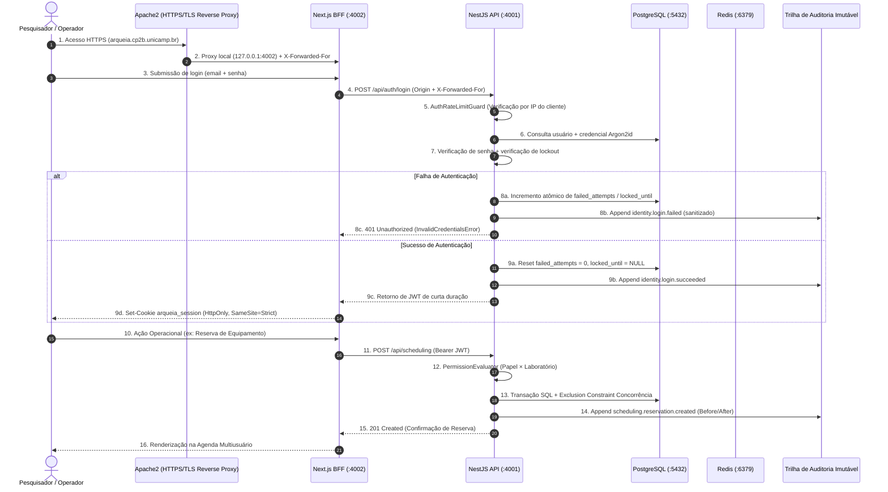

# Mapeamento do Fluxo de Dados Pessoais (Data Flow Map)

> **Classificação**: Documento Técnico e de Privacidade
> **Controlador Institucional**: Universidade Estadual de Campinas — UNICAMP (CNPJ: 46.068.425/0001-33)
> **Unidade/Órgão Responsável**: `REQUIRES INSTITUTIONAL VALIDATION`

---

## 1. Diagrama de Fluxo de Dados Ponta a Ponta

---

## 2. Pontos de Entrada, Processamento e Armazenamento

1. **Ingresso (Coleta)**:
   - Formulários administrativos para cadastro de usuários (nome, e-mail institucional).
   - Telas operacionais de agendamento de equipamentos e retirada de reagentes.
2. **Trânsito (Rede)**:
   - Criptografia obrigatória via HTTPS/TLS entre o navegador do usuário e o proxy reverso Apache2.
   - Comunicação local via interface de loopback (`127.0.0.1`) entre Apache2, Next.js, NestJS, PostgreSQL e Redis.
3. **Processamento e Autorização**:
   - Backend NestJS avalia autorização em nível de domínio (`PermissionEvaluator`).
   - Rate limiting intercepta requisições excessivas antes do processamento de hashing.
4. **Armazenamento Seguro**:
   - PostgreSQL com triggers de imutabilidade para `audit_events` e `stock_movements`.
   - Hashes de senha protegidos com Argon2id.
