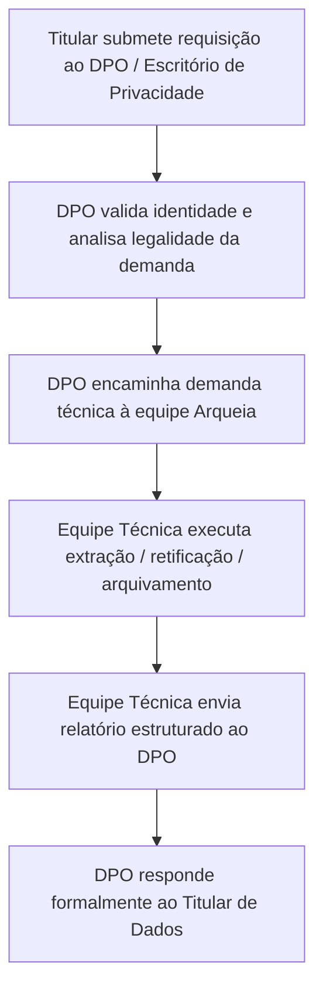

# Procedimento Operacional para Atendimento a Direitos dos Titulares (Data Subject Request Runbook)

> **Classificação**: Documento Operacional de Privacidade (LGPD Art. 18)
> **Controlador Institucional**: Universidade Estadual de Campinas — UNICAMP (CNPJ: 46.068.425/0001-33)
> **Encarregado pelo Tratamento de Dados Pessoais (DPO)**: Prof. Dr. José Luiz da Costa (`lgpd@unicamp.br`)
> **Escritório de Privacidade UNICAMP**: `privacidade@unicamp.br` | [Portal Oficial](https://www.privacidade.unicamp.br/escritorio/controlador-e-encarregado/)

---

## 1. Fluxo Institucional de Atendimento

As requisições de titulares de dados pessoais (docentes, alunos, técnicos e pesquisadores externos) ingressam formalmente através dos canais oficiais da Universidade, do Escritório de Privacidade (`privacidade@unicamp.br`) ou diretamente ao Encarregado (`lgpd@unicamp.br`).



---

## 2. Instruções Técnicas por Tipo de Requisição

### 2.1. Confirmação de Tratamento e Acesso aos Dados (Art. 18, I e II)
- **Objetivo**: Fornecer relatório estruturado com todos os dados vinculados ao titular.
- **Procedimento Técnico no Banco de Dados**:
  ```sql
  -- 1. Consulta cadastral
  SELECT id, institution_id, name, email, status, identity_provider, created_at, updated_at
    FROM users
   WHERE lower(email) = lower('<EMAIL_TITULAR>');

  -- 2. Consulta de vínculos com laboratórios
  SELECT l.name AS laboratorio, m.role, m.created_at
    FROM memberships m
    JOIN laboratories l ON l.id = m.laboratory_id
    JOIN users u ON u.id = m.user_id
   WHERE lower(u.email) = lower('<EMAIL_TITULAR>') AND m.archived_at IS NULL;

  -- 3. Histórico de reservas de equipamentos
  SELECT r.id, e.name AS equipamento, r.starts_at, r.ends_at, r.status, r.purpose
    FROM reservations r
    JOIN equipment e ON e.id = r.equipment_id
    JOIN users u ON u.id = r.user_id
   WHERE lower(u.email) = lower('<EMAIL_TITULAR>');

  -- 4. Histórico de retiradas de estoque
  SELECT sm.id, p.name AS produto, sm.quantity, sm.type, sm.purpose, sm.performed_at
    FROM stock_movements sm
    JOIN products p ON p.id = sm.product_id
    JOIN users u ON u.id = sm.user_id
   WHERE lower(u.email) = lower('<EMAIL_TITULAR>');
  ```

### 2.2. Correção de Dados Incompletos, Inexatos ou Desatualizados (Art. 18, III)
- **Objetivo**: Atualizar nome ou e-mail institucional.
- **Procedimento Técnico**:
  A alteração deve ser realizada preferencialmente pela interface administrativa (`PATCH /api/users/:userId`) por um usuário com perfil `ADMIN`, gerando evento de auditoria imutável `identity.user.updated` com os valores *before/after*.

### 2.3. Solicitação de Anonimização, Bloqueio ou Eliminação (Art. 18, IV e VI)
- **Ponderação Institucional Obrigatória**:
  - Dados estritamente necessários para a prestação de contas de projetos financiados com recursos públicos (FAPESP, CNPq) e registros de auditoria imutável **não podem ser excluídos sumariamente** antes do cumprimento dos prazos legais/regulatórios de guarda (Art. 16, I e II da LGPD).
- **Procedimento para Inativação e Restrição de Acesso**:
  1. Arquivar a conta de usuário (`archived_at = now()`, `status = 'SUSPENDED'`), revogando imediatamente a capacidade de login e visualização operacional.
  2. As referências históricas em livros-razão permanecem protegidas para integridade contábil e de prestação de contas.
