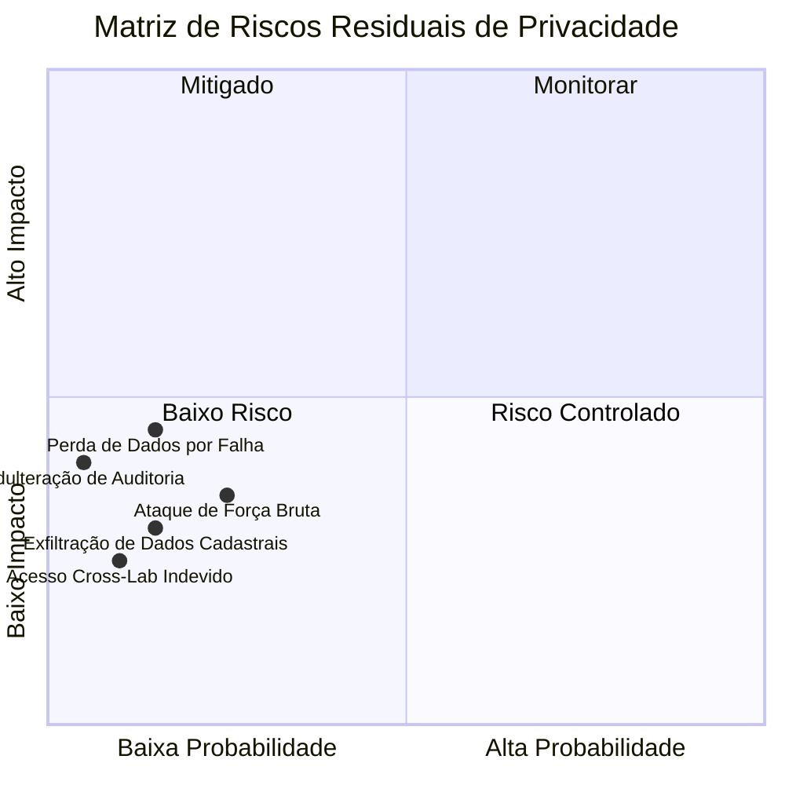

# Registro e Análise de Riscos de Privacidade (RIPD Risk Register)

> **Classificação**: Documento de Gestão de Riscos
> **Controlador Institucional**: Universidade Estadual de Campinas — UNICAMP (CNPJ: 46.068.425/0001-33)
> **Metodologia**: Matriz de Risco $Impacto \times Probabilidade$

---

## 1. Matriz de Avaliação de Riscos

---

## 2. Detalhamento dos Riscos e Tratamentos

### Risco 1: Ataque de Força Bruta contra Credenciais de Usuário
- **Descrição**: Tentativa automatizada de adivinhação de senhas via endpoint de login.
- **Ameaça aos Titulares**: Comprometimento de conta e acesso não autorizado à agenda/estoque.
- **Probabilidade Inerente**: Média | **Impacto Inerente**: Alto
- **Controles Implementados**:
  - Hashing Argon2id ($m=19456\text{ KB}$, $t=2$, $p=1$, len=32).
  - Bloqueio automático de conta por 15 minutos após 5 erros consecutivos (`locked_until`).
  - Rate limiting na API (máx. 10 requisições/min por IP).
  - Emissão de evento de auditoria `identity.login.failed`.
- **Probabilidade Residual**: Baixa | **Impacto Residual**: Baixo | **Nível de Risco**: **ACEITÁVEL / CONTROLADO**

---

### Risco 2: Vazamento de Dados Pessoais via Trilha de Auditoria
- **Descrição**: Persistência inadvertida de senhas, tokens ou dados sensíveis em logs ou tabelas de auditoria.
- **Ameaça aos Titulares**: Exposição de credenciais em relatórios ou consultas administrativas.
- **Probabilidade Inerente**: Média | **Impacto Inerente**: Alto
- **Controles Implementados**:
  - Sanitização automática (*redaction*) em `PostgresManagementRepository` removendo chaves `password`, `token`, `secret`, `authorization`, `cookie`.
  - Casos de uso sanitizam payloads *before/after* antes de persistir em `audit_events`.
  - Zero chamadas a `console.log` em código de produção.
- **Probabilidade Residual**: Muito Baixa | **Impacto Residual**: Muito Baixo | **Nível de Risco**: **MITIGADO**

---

### Risco 3: Acesso Cruzado Indevido entre Laboratórios Distintos (Cross-Lab Leak)
- **Descrição**: Usuário de um laboratório visualizando dados operacionais ou insumos de outro laboratório.
- **Ameaça aos Titulares**: Quebra de sigilo de projetos concorrentes de pesquisa científica.
- **Probabilidade Inerente**: Média | **Impacto Inerente**: Médio
- **Controles Implementados**:
  - Modelo RBAC Papel × Laboratório avaliado rigidamente no servidor (`PermissionEvaluator`).
  - Chaves estrangeiras compostas e constraints SQL de integridade laboratorial.
  - Testes reais automatizados de isolamento multi-tenant.
- **Probabilidade Residual**: Muito Baixa | **Impacto Residual**: Muito Baixo | **Nível de Risco**: **MITIGADO**

---

### Risco 4: Indisponibilidade de Dados por Falha de Infraestrutura
- **Descrição**: Perda de registros operacionais ou histórico de agendamentos por corrupção de disco na VM.
- **Ameaça aos Titulares**: Impossibilidade de comprovação de uso de equipamento para prestação de contas.
- **Probabilidade Inerente**: Baixa | **Impacto Inerente**: Alto
- **Controles Implementados**:
  - Rotina de backup lógico diário automatizado com snapshots compactados e retenção histórica.
  - Runbook formal de recuperação e procedimentos de Disaster Recovery testados.
- **Probabilidade Residual**: Baixa | **Impacto Residual**: Baixo | **Nível de Risco**: **ACEITÁVEL / CONTROLADO**
