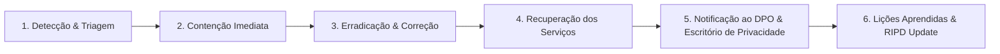

# Plano de Resposta a Incidentes de Segurança e Privacidade (Incident Response Runbook)

> **Classificação**: Documento Operacional e de Governança
> **Controlador Institucional**: Universidade Estadual de Campinas — UNICAMP (CNPJ: 46.068.425/0001-33)
> **Encarregado pelo Tratamento de Dados Pessoais (DPO)**: Prof. Dr. José Luiz da Costa (`lgpd@unicamp.br`)
> **Escritório de Privacidade UNICAMP**: `privacidade@unicamp.br` | [Portal Oficial](https://www.privacidade.unicamp.br/escritorio/controlador-e-encarregado/)

---

## 1. Classificação de Severidade de Incidentes

| Nível | Definição / Cenário | Exemplo no Arqueia | Tempo de Resposta Inicial |
| :--- | :--- | :--- | :---: |
| **P0 (Crítico)** | Exfiltração massiva de dados pessoais, vazamento comprovado da `JWT_SECRET` de produção, ou acesso administrativo não autorizado à base de dados. | Acesso indevido direto ao PostgreSQL ou exfiltração de base de credenciais. | Até 1 hora |
| **P1 (Alto)** | Comprometimento isolado de conta de usuário com privilégios de gestão (`ADMIN` ou `TECNICO`), ou suspeita de ataque de força bruta bem-sucedido. | Tentativas anômalas com sucesso após múltiplos disparos de auditoria de falha. | Até 4 horas |
| **P2 (Médio)** | Tentativa persistente de negação de serviço ou disparo excessivo de bloqueios de conta (DoS lógico). | Ataque de flooding contra o endpoint `/api/auth/login`. | Até 12 horas |
| **P3 (Baixo)** | Anomalia pontual em logs de aplicação sem evidência de comprometimento ou exposição de dados pessoais. | Erros de validação Zod inesperados em endpoints públicos. | Até 24 horas |

---

## 2. Fluxo de Ação em Caso de Incidente (Fases NIST / ANPD)



### Fase 1: Detecção e Triagem
- **Fontes de Alerta**: Trilha de auditoria (`audit_events` com múltiplos eventos `identity.login.failed`), logs de acesso do Apache (`/var/log/apache2/arqueia_error.log`), logs do PM2 (`pm2 logs`).
- **Ação**: Identificar o escopo, IPs envolvidos, contas afetadas e se houve comprometimento de dados pessoais.

### Fase 2: Contenção Imediata
- **Bloqueio de IP na VM**:
  ```bash
  sudo iptables -A INPUT -s <IP_ATACANTE> -j DROP
  ```
- **Invalidação Geral de Sessões (se `JWT_SECRET` comprometida)**:
  1. Alterar a chave `JWT_SECRET` no arquivo `.env` da VM.
  2. Reiniciar a API e BFF:
     ```bash
     pm2 restart ecosystem.config.js
     ```
- **Suspensão de Conta Comprometida**:
  ```sql
  UPDATE users SET status = 'SUSPENDED', updated_at = now() WHERE id = '<USER_ID>';
  ```

### Fase 3: Erradicação e Correção
- Identificar e neutralizar a causa raiz (correção de vulnerabilidade de código, rotação de senhas do banco de dados ou ajuste de regras de firewall).
- Executar testes automatizados completos e linters antes do redeploy.

### Fase 4: Recuperação dos Serviços
- Restauração de integridade a partir de backup validado (se houve corrupção de dados).
- Monitoramento reforçado de tráfego e logs nas 48 horas subsequentes.

### Fase 5: Comunicação Institucional e Notificação do DPO
- Caso o incidente envolva risco ou dano relevante aos titulares de dados pessoais:
  1. Elaborar relatório técnico preliminar (data/hora, dados afetados, medidas tomadas).
  2. Notificar imediatamente o **Encarregado (DPO UNICAMP)** (`lgpd@unicamp.br`) e o **Escritório de Privacidade** (`privacidade@unicamp.br`).
  3. O DPO institucional avaliará a necessidade de notificação formal à **ANPD** (Autoridade Nacional de Proteção de Dados) no prazo regulamentar e aos titulares afetados.

### Fase 6: Lições Aprendidas e Atualização do RIPD
- Registro formal do incidente no livro de ocorrências do sistema.
- Revisão dos controles preventivos e atualização do Plano de Ação do RIPD.
